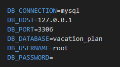
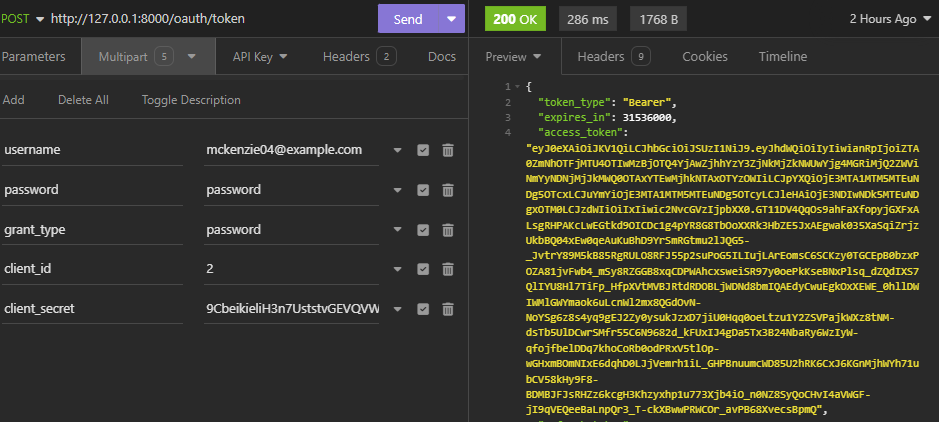
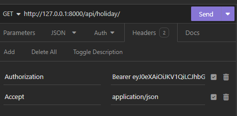
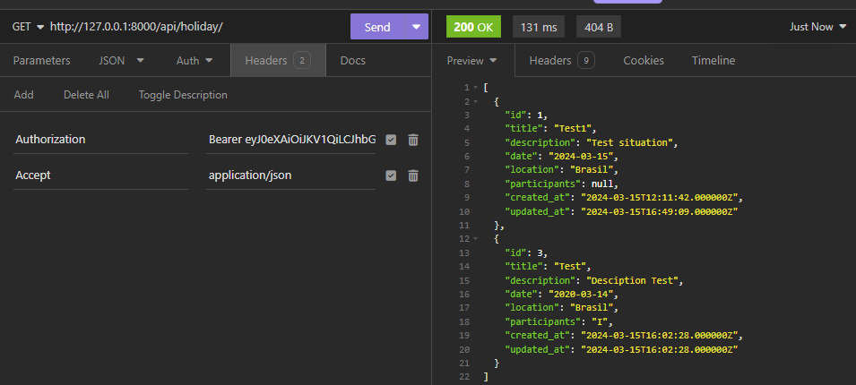
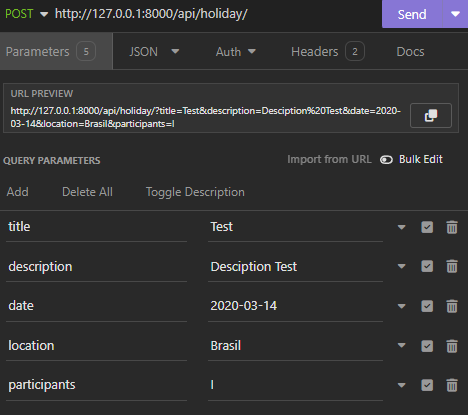
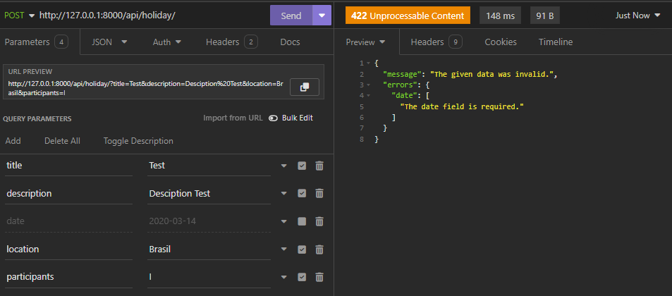
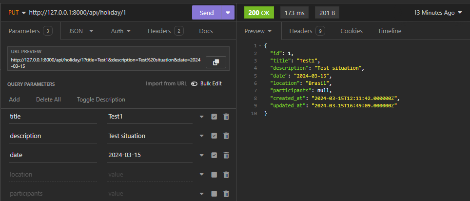
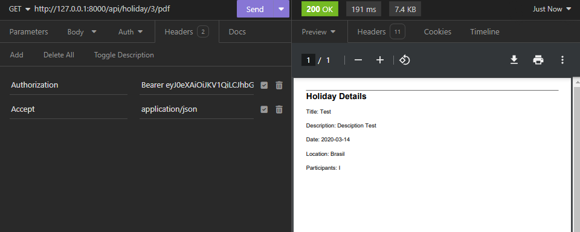

# Vacation Plan API

 Available in : https://github.com/NilsonJorge/Vacation_Plan

This API was developed using the Laravel Framework and aims to manage vacation plans throughout the year. It works with the following data:

- Title 
- Description
- Date
- Location
- Participants(Optional)


In this API you can view, add, edit, delete and generate a PDF for a specific vacation plan.

## Installations

For this API, Laravel Passport was used for authentication.

You need to have composer installed and install the TCPDF library with the command:
```
 composer require tecnickcom/tcpdf
```
To access the Endpoints, [Insomnia](https://insomnia.rest/download) was used.

## DataBase Configuration

First, place your database in the .env file, as shown in the image [DataBase Configuration in Laravel](image/db.png)




Then use the ```php artisan migrate --seed command``` to generate the tables and users.

Access the database and check if they were created.

Use ``php artisan passport:install`` to generate clients.

## EndPoints

### Authentication 

This Endpoint, which aims to obtain access to the other endpoints, is accessed through the URL: http://127.0.0.1:8000/oauth/token and the POST method is used, where you must pass one of the usernames generated and stored in the "users" table and the client secret, generated when running ``php artisan passport:install``, the other parameters remain the same as in the image [Authentication](image/authentication.png). In response, the "acess_token" is obtained, highlighted in the image. This "access_token" will be used to authorize access to other endpoints.



To authorize access to other endpoints, for each HTTP request you must place in the request header, in the Authorization field, the "token_type" followed by the "access_token". As per the image [Authorization](image/authorization.png):


### GET All

This Endpoint aims to collect all vacation plans stored in the Database. It is accessed through the URL: http://127.0.0.1:8000/api/holiday/ and the GET method is used. It will return status code 200 if the request is successful. An example of a request can be seen in the image [GET All Example](image/getall.png):



### GET Specific

This Endpoint aims to collect a specific vacation plan stored in the Database. It is accessed through the URL: http://127.0.0.1:8000/api/holiday/ and the GET method is used, however you must pass the id of the saved Holiday Plan, thus, to access the Plan with id = 1, you must use the URL: http://127.0.0.1:8000/api/holiday/1. It will return status code 200 if the request is successful. If the id does not exist in the database, the status code 404 and the following message will be returned:

``	"message": "No query results for model [App\\Models\\Holiday] id"``

### POST Holiday plan

This Endpoint aims to add a new vacation plan to the Database. It is accessed through the URL: http://127.0.0.1:8000/api/holiday/ and the POST method is used. To add a new plan, you must pass the names of the attributes and their respective values ​​as parameters, as shown in image [POST Holiday parameters](image/postparameters.png). If successful, the status code 201 will be returned. If a mandatory parameter is not entered, the message will be returned as shown in the [POST Holiday error](image/posterror.png) image.





### DELETE Holiday plan

This Endpoint aims to delete a specific vacation plan stored in the Database. It is accessed via the URL: http://127.0.0.1:8000/api/holiday/ and the DELETE method is used, however you must pass the id of the saved Holiday Plan, thus, to delete the Plan with id = 1, you must use the URL: http://127.0.0.1:8000/api/holiday/1. It will return status code 200 if the request is successful. If the id does not exist in the database, the following message will be returned:

``"message": "No query results for model [App\\Models\\Holiday] id"``

### UPDATE Holiday plan

This Endpoint aims to update the data of a specific vacation plan stored in the Database. It is accessed via the URL: http://127.0.0.1:8000/api/holiday/ and the PUT method is used, however you must pass the id of the saved Holiday Plan, thus, to update the Plan with id = 1, you must use the URL: http://127.0.0.1:8000/api/holiday/1 and you must pass which parameters will be updated, as shown in image [UPDATE Holiday plan](image/updateplan.png). It will return the status code 200 and the message " Holiday Plan updated successfully", if the request is successful.



### Generate PDF

This Endpoint aims to generate a PDF with the data of a specific vacation plan stored in the Database. It is accessed through the URL: http://127.0.0.1:8000/api/holiday/1/pdf and the GET method is used, the id of the saved Holiday Plan must be passed, in the URL used it was generated for the id = 1. Will return status code 200 and the generated PDF if the request is successful.


